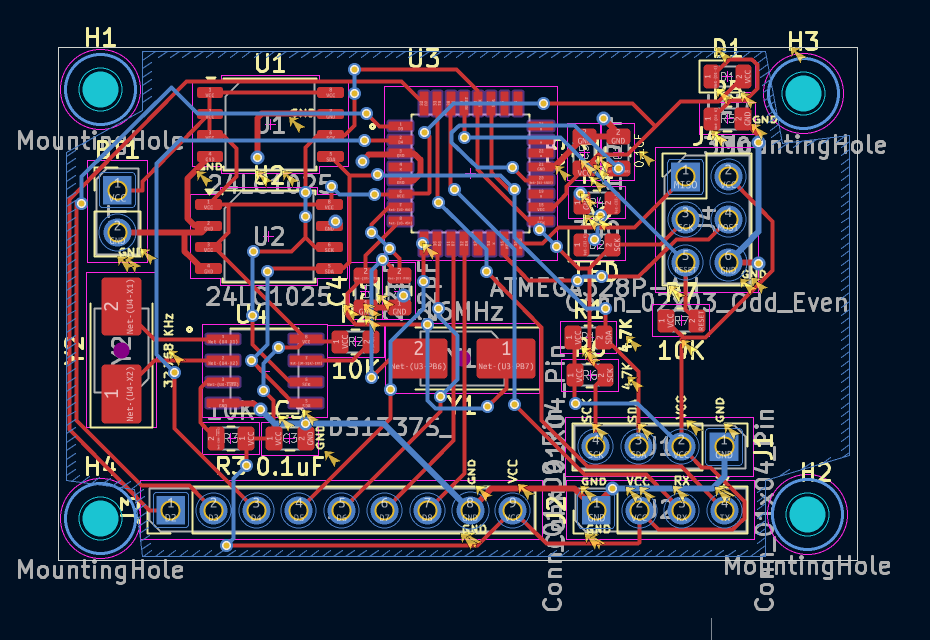
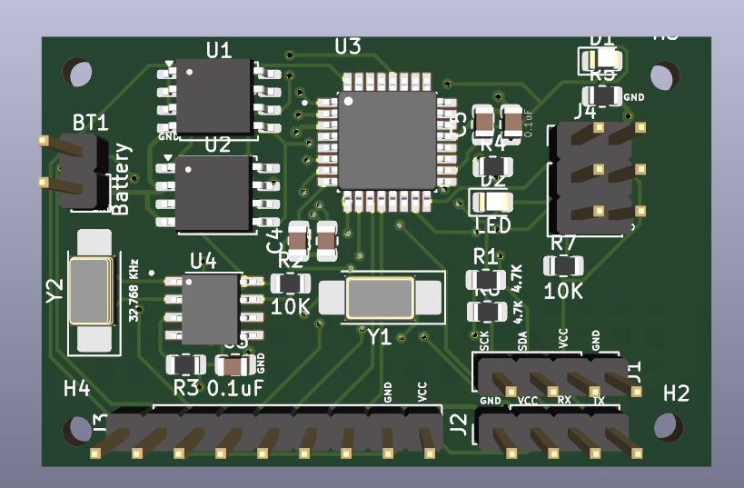
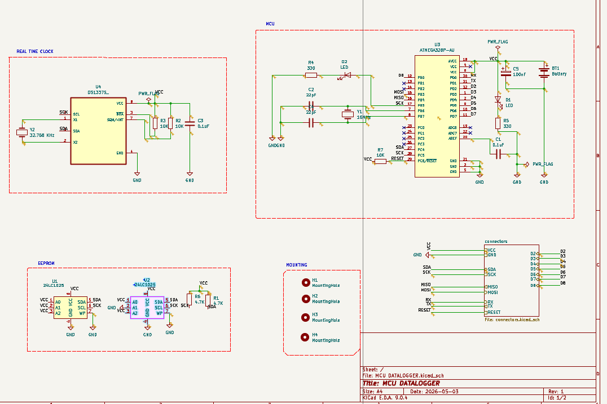

# MCU Data Logger (STM32 + RTC + EEPROM)

## Overview

This project is a microcontroller-based data logger built using STM32, an external RTC (DS1337), and EEPROM (24LC1025).
The system is designed to log time-based data with reliable storage and external interfacing.

---

## Features

* STM32-based embedded system
* External RTC for accurate timekeeping
* EEPROM for persistent data storage
* I2C communication (RTC + EEPROM)
* UART interface for debugging/logging
* SPI/ICSP interface exposed
* Custom 2-layer PCB designed in KiCad

---

## Hardware Design

### Key Design Decisions

* Pull-up resistors used for I2C communication lines
* Separate crystal circuits:

  * 16 MHz for MCU
  * 32.768 kHz for RTC
* Decoupling capacitors placed near each IC
* Reset circuit designed with pull-up resistor
* EEPROM addressing configured for multiple devices

---

## PCB Layout

* 2-layer PCB design
* Ground plane used for improved signal integrity
* Component placement based on signal flow
* Short routing for critical signals (clock, I2C)

---

## Images

### PCB Layout

### 3D View

### Schematic

---

## What I Learned

* Designing complete embedded hardware systems
* PCB routing and layout considerations
* Interfacing peripherals using I2C, SPI, UART
* Importance of grounding, decoupling, and clock design

---

## Future Improvements

* Add SD card for large data logging
* Implement firmware for real-time logging
* Improve PCB layout optimization

---

## Tools Used

* KiCad (Schematic & PCB Design)
* STM32CubeIDE / Keil (Firmware)
* Oscilloscope, Logic Analyzer (Debugging)

---
